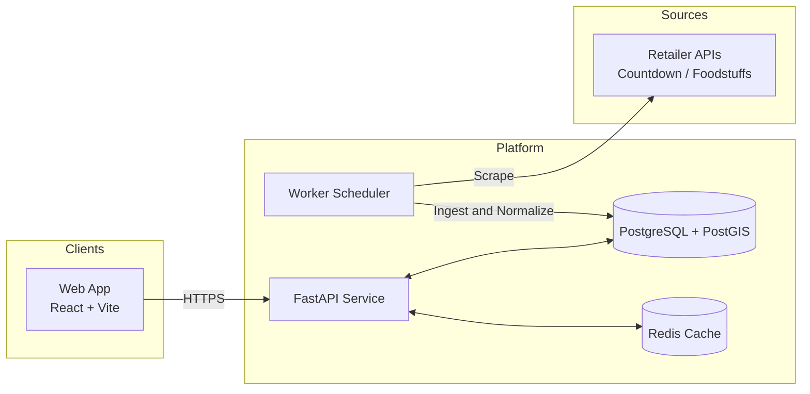
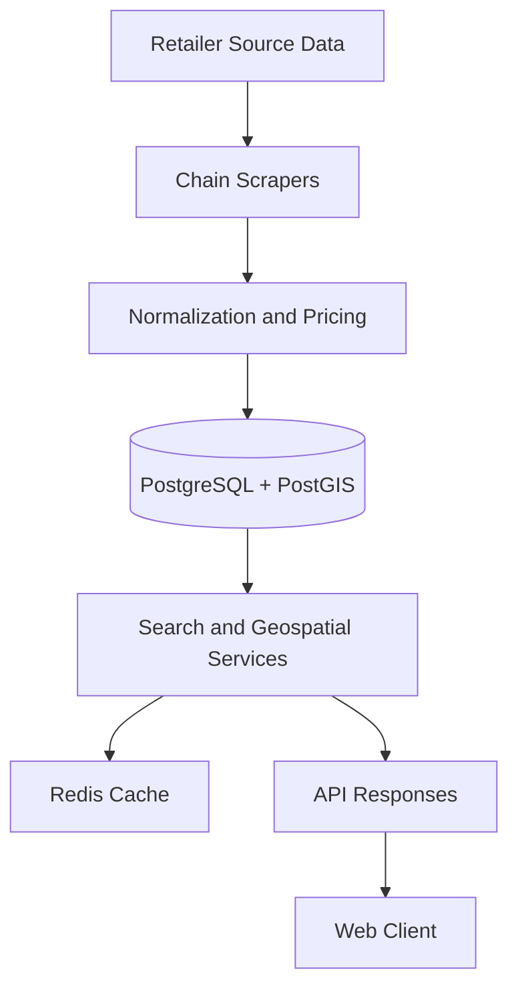

# Grocify


Grocify is a location-aware grocery price comparison platform for New Zealand. It combines a FastAPI backend, scheduled scraping workers, and a React frontend to surface nearby deals across Countdown, PAK'nSAVE, and New World with trolley comparison and store ranking features.

## Table of Contents

- [Architecture](#architecture)
- [Data Flow](#data-flow)
- [Core Capabilities](#core-capabilities)
- [Getting Started](#getting-started)
- [Local Development](#local-development)
- [API Overview](#api-overview)
- [Operations and Reliability](#operations-and-reliability)
- [Repository Layout](#repository-layout)

## Architecture



## Data Flow



## Core Capabilities

- Aggregates product and price data from Countdown, PAK'nSAVE, and New World.
- Supports geospatial store and product discovery with configurable radius constraints.
- Provides trolley comparison to find the cheapest store for an entire shopping list.
- Suggests alternative products when items are unavailable at a given store.
- Ranks stores by category to surface the best deals nearby.
- Provides scheduled scraper execution via a dedicated worker service.
- Includes Redis-backed response caching for high-traffic queries.
- Ships with production-minded defaults: health checks, security headers, and rate limiting.

## Getting Started

### Prerequisites

- Docker and Docker Compose
- Python 3.11+
- Node.js 18+ (for running frontend outside Docker)
- Poetry

### Quickstart (Full Stack via Docker)

```bash
cp .env.example .env
docker compose -f infra/docker-compose.yml up --build
```

Services started:

- `web` at `http://localhost:5173`
- `api` at `http://localhost:8000`
- `db` (PostgreSQL/PostGIS) on `localhost:5432`
- `redis` on `localhost:6379`
- `worker` for scheduled ingestion

### Production Stack (Docker Compose)

```bash
docker compose -f infra/docker-compose.prod.yml up -d --build
```

## Local Development

### 1) Install backend dependencies

```bash
poetry install
```

### 2) Start dependencies (db + redis)

```bash
docker compose -f infra/docker-compose.yml up -d db redis
```

### 3) Run API

```bash
poetry run uvicorn app.main:app --reload --app-dir api
```

### 4) Run worker

```bash
poetry run python -m app.workers.runner
```

### 5) Run frontend

```bash
cd web
npm install
npm run dev
```

### 6) Run tests

```bash
cd api
python3 -m pytest app/tests/ -v
```

## API Overview

Interactive API docs: `http://localhost:8000/docs`

Core endpoints:

- `GET /healthz` - liveness probe.
- `GET /health` - dependency-aware health check (database + Redis).
- `GET /readiness` - readiness probe.
- `GET /products` - filtered and paginated product search.
- `GET /products/{product_id}` - product detail with all store prices.
- `GET /stores` - geospatial nearby stores.
- `GET /stores/rankings` - rank stores by category.
- `POST /trolley/compare` - compare cart cost across nearby stores.
- `POST /trolley/suggestions` - suggest alternatives for missing items.
- `POST /auth/login` - JWT token issuance.
- `POST /auth/logout` - token revocation.
- `POST /ingest/run/{chain}` - trigger ingestion (admin-protected).
- `GET /worker/status` - scraper status summary.

## Operations and Reliability

- Development environment template: `.env.example`
- Production compose file: `infra/docker-compose.prod.yml`
- Container definitions: `infra/dockerfiles/`
- Nginx runtime config: `infra/nginx/`
- Health checks are configured at both API and container levels.
- Security middleware adds standard hardening headers.

## Repository Layout

```text
api/          FastAPI app, services, scrapers, worker, tests
web/          React + Vite frontend
infra/        Dockerfiles, Compose files, Nginx config
```
